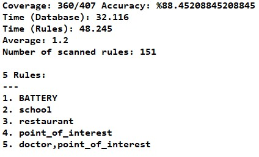
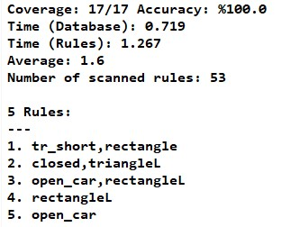

= Association Rule Mining with Apriori Algorithm and Neo4j Graph Database

Association rule mining by using the Apriori algorithm which is one of the data mining techniques and Neo4j Graph Database.

1. <<1. Chicago Crimes Dataset (2012-2017),Chicago Crimes Dataset>>.
2.  <<2. Eastbound Dataset,Eastbound Dataset>>.

---
* Copy the files in forDB folder into the path below:

C:\Users\USERNAME\.Neo4jDesktop\neo4jDatabases\database-YOUR_DB\installation-A.B.C\import 

* Change connection parameters

[source,java]
----
 public static void main(String... args) throws FileNotFoundException, IOException {
        //Server connection
        Crimes db = new Crimes("bolt://localhost:YOUR_PORT", "neo4j", "PASSWORD"); // Change this to your own parameters

        ...
        }
----

---

=== 1. Chicago Crimes Dataset (2012-2017)

Association rule mining on the relationship between the places near the crime and the arrest.

For example, if the school is a rule, Every crime committed near the school is resulting in arrest.

Datasets: Chicago Crimes Dataset, Places Dataset which we created via Google Places API and Google Geocoding API.

Chicago Crime Dataset Columns:

* ID : Case ID
* Date : Case Date
* Primary Type : Crime Type
* Location Description : Crime Location
* Arrest : Is arrested ? (True or False)
* Latitude : Latitude value
* Longitude : Longitude value

Places Dataset Columns:

* ID : Case ID same with Crime Dataset
* Place : Place type (university,restaurant etc.)
* Name : Place name (Kocaeli University etc.)
* Distance : Distance from crime location

=====  Results with Chicago Crimes Dataset

---
=== 2. Eastbound Dataset

Association rule mining on the relationship between the car features and the cars which go east.

For example, if the open car is a rule, Every car with that feature goes east.

Eastbound Dataset Columns:

* Car : Car ID
* Direction : East or west
* Shape : Car shape (rectangle, hexagon etc.)
* Wheel : Number of wheel (2 or 3)
* Length : Car length (short or long)
* closed : Is car closed ? (true or false)
* jagged : Is car jagged ? (true of false)
* Load : Type of load
* open_car : Is car open ? (true or false)
* tr_double : True or false

===== Results with Eastbound Dataset

